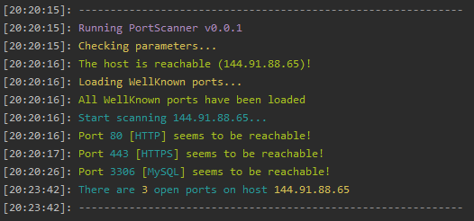
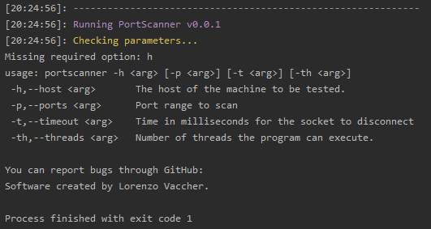

# JPortScanner

JPortScanner is a software developed in Java that allows you to scan a Host by checking for any open ports. This program works with `Sockets`, to establish a possible connection with the server and with a port, which is obtained from the range passed as parameter. The operation of the program is very simple and basic: if the server manages to establish a connection, the tested port is open, otherwise, if it fails to establish a connection within the time indicated by the `timeout` parameter, the port will be closed.

> You can find more information about **Sockets** [here](https://www.javatpoint.com/socket-programming).

## TODO
 - [ ] Saving the result in a CSV file
 - [ ] Saving the result in a PDF file

## How it works
To run the program, download the .jar file from this Repository and run it using the following command:
`java -jar PortScanner.jar`

The program accepts the following parameters as inputs, which must be passed at run time:
| Parameter | Required | Description | Example |
|:--:|:--:|--|--|
| -h | yes | Name of the **Host** to check | -h lorenzovaccher.com
| -p | no | Range of **ports** to check | -p 1-65535 |
| -t | no | **Timeout** for Socket disconnection | -t 100 |
| -th | no | Number of **Threads** to run | -th 32 |

Ex: `java -jar PortScanner.jar -h lorenzovaccher.com -t 150 -th 100 -p 1024-5000`

> **Warning**: Since it's a program that uses the network to perform the verification, it is reccommended to use the Threads according to the speed of your internet connection and not the computational capacity of your computer. Some tests show that with **60Mbps** in **download** and **15Mbps** in **upload** it is possible to use **32 Threads** without having any problems. A connection with **500Mbps** in **download** and **200Mbps** in **upload** can also handle **800 Threads**.

## Screens

  
  

---
Software created by **Lorenzo Vaccher** with the help of [**Jia Hao Ruan**](https://github.com/RuanJiaHao) for tranlations.
